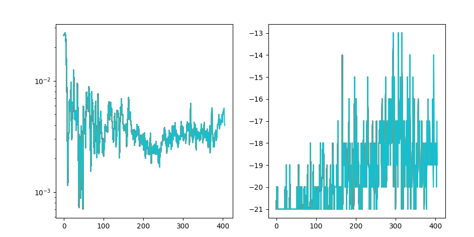
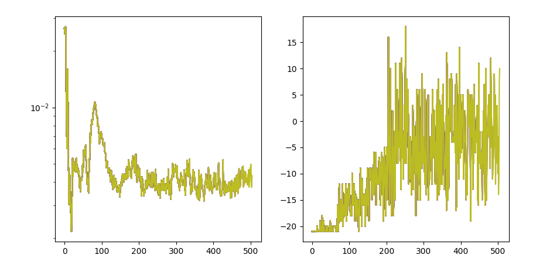
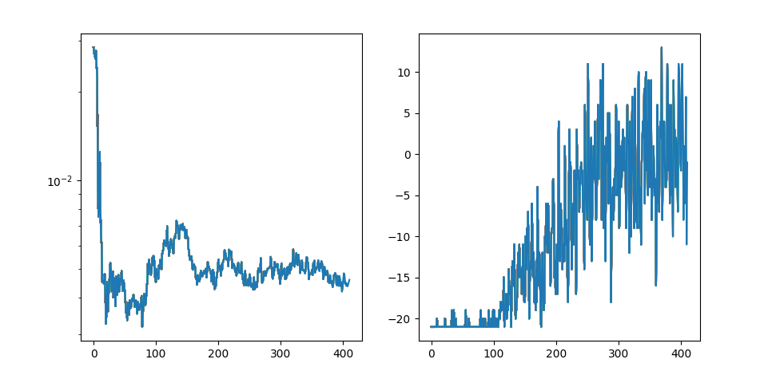
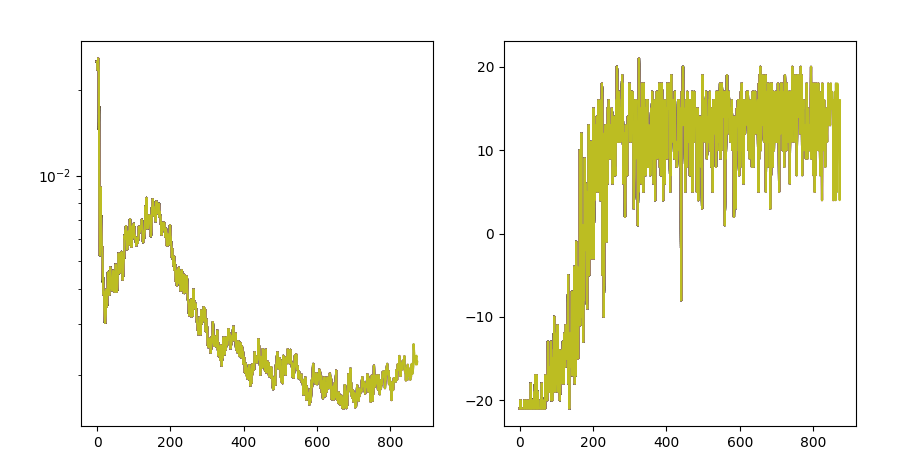
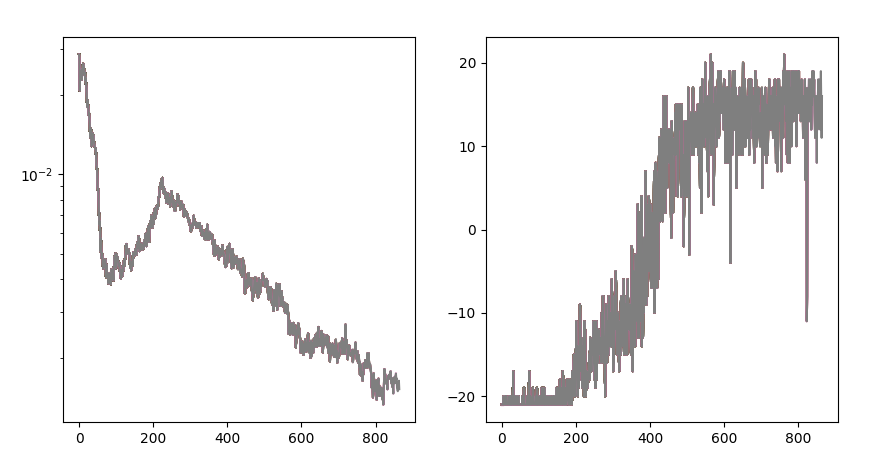

# Improvment note

## Preprocessing
After search online, I realize the impostance of preprocessing. 
1. resize to 84x84 pixels to improve efficient, so that we use more powerful net structure
2. Greyscale data
3. stack 4 frames to allow net get knowledge of object speed

## memory

Previously, the replay memory buff is 2000 frame, which is too small for Pong, as each episode of play can contains more than 2000 frames, which can result in high stochastic and variance. Short memory may only contain frames of 1 episoid, which may not contain good play cases result in failed training. larger buff prevent the agent from overfitting to recnent experiences (sometime could be failure experience) instead of generalizable policy. 

Large memory buff help breaking correlations. Consecutive experiences in Reinforcement learning are often highly correlated, especially in environments with smooth dynamics. A larger buffere allows sampling from a wider range of past experiences, which helps break the temporal correlations in the data and stabilizes learning. 

In small replay buffers, older transitions are overwritten quickly, potentially erasing valuable experiences, especially those related to rare or critical events (e.g. significant rewards or transitions leading to terminal states)

In small buffers, critical transitions may get replaced quickly, leading to the agent "forgettting" certain learned behaviors, result in catastrophic forgetting. 

A large replay buffer support the agent's exploration by providing a broad set of scenarios, it reduces the risk of the agent becoming stuck in local optima by continuously revisiting diverse states and actions. 

trains-2 in pong-20250110-3 shows significant performance increase after increase the memory buff to 20000 from 2000. 

## Game selection
Pong-v5 seems harder than PongNoFrameskip-v4. The same configuration, PongNoFrameskip-v4 converage faster with much higher score. 

PongNoFrameskip-v4

PongNoFrameskip-v4 - lr 2e-5 (default 1e-4)
