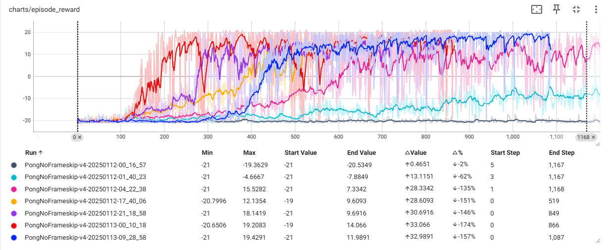
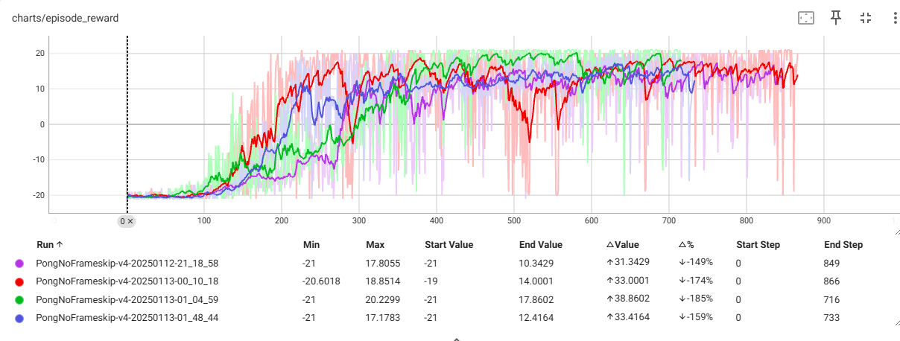
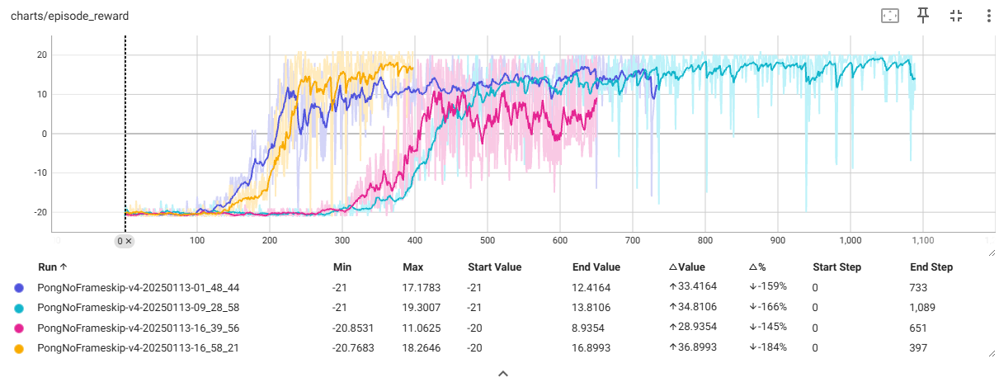

# fixed Highligh issues

- **Major**: In the ppo_agent.py, **fixed the way to calculate "Returns"**. returns refer to the cumulative rewards collected by an agent from a given state onward in an episode. Returns can be used to estimate state values with Monte Carlo (MC) algoirthm. This is very impotant. 
```python
# below method work greatly
returns = advantages + values

# not sure why below doesn't work. 
returns = []
G = 0
for reward, done in zip(reversed(rewards), reversed(next_dones)):
    G = reward + self.gamma * G * (1 - done)
    returns.append(G)
returns.reverse()
```
- **Major**: In the ppo_agent.py, fixed normalization of advantages. Normalize the advantage in every mini-batch instead of whole episode.
- *Minor*: In the ppo_agent.py, duplicate smaple to integer number of mini-batch size to ensure the same size for each mini-batch. Slightly increase model quality. 
- *Minor*: normalize the observiation/model input. initially, I forget to divide the gym env observation by 255.0 to normalize data between 0 to 1. Therefore, the mode takes long time to converge. After normalizaion, it converage much fast. Slightly increase model quality. 
- **Major**: entropy loss coefficient, revised from 0.1 to 0.01. Regarding Entropy Regularization, Paper suggest coefficient 0 to 0.01. Original setting is too large which result in unstable and bad result. cite from paper: The entropy coefficient is multiplied by the maximum possible entropy and added to loss. This helps prevent premature convergence of one action probability dominating the policy and preventing exploration. 

## plots


### Highligh issues repair plot 
The notes for below plots, in the order of time.  

- Before repair issues
- Nomalize the advance in mini-batch instead of whole episode and fixed the way to calculate returns
- change (batch_size:256, update_epochs:10) to (batch_size:32, update_epochs:4)
- Initialize model weights by using torch.nn.init.orthogonal_()
- Normalize the input by divide x by 255.0
- revised entropy loss coefficient from 0.1 to 0.01
- Increase the batch_size from 32 to 128 to stablize the output. 

### entropy loss coefficient

- revised entropy coefficient 0.1
- revised entropy coefficient 0.01 - first run 
- revised entropy coefficient 0.01 - second run
- revised entropy coefficient 0.01 - third run

# Sean implementation vs clearRL

Sean's PPO implemented to play black myth game. This game play won't wait model training until one round completed. Therefore, the data collection always includes a whole round game. The game cannot be paused during one round. Therefore, the policy update process is:
1. play game by using current policy and collect whole round of game play data 
2. optimize the plicy and value network with PPO algoirthm. 
3. repeat step 1

In this case, each iteration comes with diffent length of training data (episode). If there is extra long episode, in the case of fixed mini-batch size, the long episode could be used update policy extensive times. The model may be overfitting to the episode and result high variance during the training. 
- Large batch size has small variance, but slow to train, long lead time. 
- Small batch has large variance, but fast, short lead time. 
- Different size of episode can result in overfitting to long episode and result in unstable. 

To optimize the training, we could introduce dynamic batch size and limit number of mini-batch in each epoch. 

```python
def get_dynamic_batch_size(nth_episode, episode_length):
    """
    Due to the length of episode is not fixed, if the mini-batch size is fixed, PPO policy update for each iteration will not be stable.
    For example, if the episode length is short, a certain iteration will update policy a small number of times, let say 16 times.
    Once the episode length is long, the policy will be updated a lot more times in one iteration, let say 160 times, which result in overfitting to a specific episode, result unstable.
    We need to guarantee the policy shouldn't be updated to much within each policy iteration cycle.
    Use dynamic mini-batch size to achieve two purpose:
    1. initially, the batch size is small to ensure a quick training. Small batch is fast but high variance/unstable. we want it fast and high variance is acceptable initially. 
    2. Following, the batch size will increase to ensure a stable finaly result. Mitigate the affect of high variance of episode length. 
    3. finally, the min_num_minibatch_per_epoch will decide 4 mini-batch per epoch, each policy iteration will only update weights 4 times per epoch, avoid overfitting. 
    """
    mini_batch_size = hyperparameters['batch_size']
    mini_num_minibatch = hyperparameters['min_num_minibatch_per_epoch']
    batch_size = mini_batch_size + nth_episode # increase batch_size by 1 for each episode
    if(episode_length <= mini_batch_size* mini_num_minibatch):
        return mini_num_minibatch
    if(episode_length  < batch_size * mini_num_minibatch):
        batch_size = (episode_length - 1)//mini_num_minibatch + 1
    return batch_size
```

- batch_size 32, fixed batch_size
- batch_size 128, fixed batch_size
- dynamic batch size, batch mini_batch_size 32, min_num_minibatch_per_epoch 4
- dynamic batch size, batch mini_batch_size 32, min_num_minibatch_per_epoch 16

## Why clearRL don't need dynamic batch size

ClearRL always collect fixed number of steps, regardless if episode is completed or not. So in each policy update iteration, the number mini-batch is always the same.  

# other way to implement stablility

- Reduce the learning rate or learning rate anneal. 
- clip on the value loss
- nn.utils.clip_grad_norm_(self.model.parameters(), self.max_grad_norm) to limit max norm of grad before optimize
- L1/L2 regularization
  