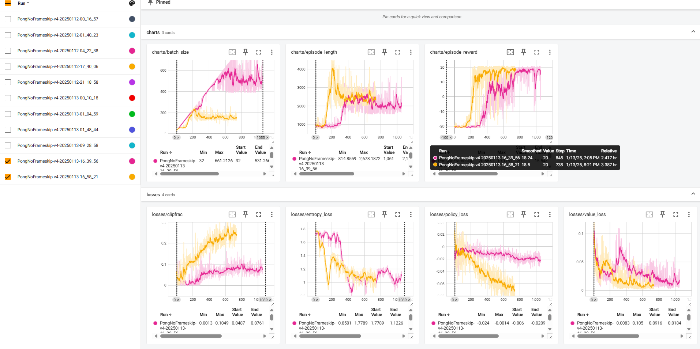
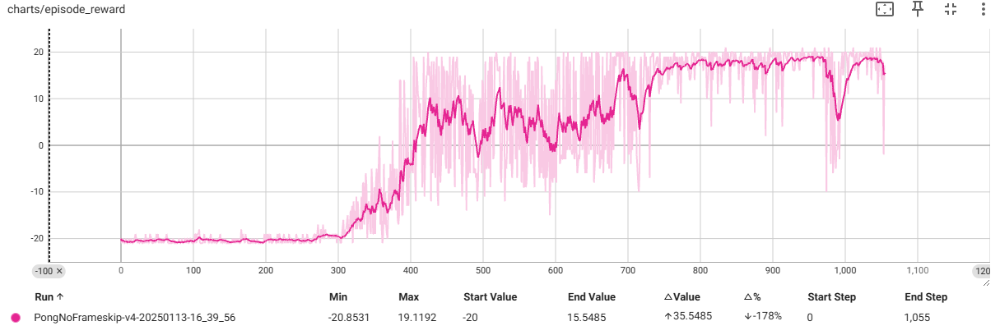
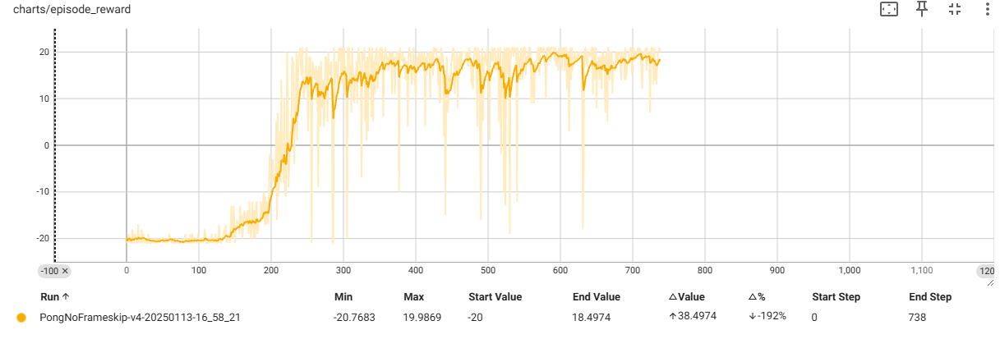

# About the demo

Please check demo.ipynb jupter notebook to see to run exactly. 

- demo-1 with earlier timestamp, 16:39:56
- demo-2 with later timestamp, 16:58:21

## demo-1

trained with below parameters
|param|value| 
|-|-|
|batch_size|32|
|update_epochs|4|
|learning_rate|0.00025|
|gamma|0.99|
|lam|0.95|
|clip_epsilon|0.2|
|**dynamic_batch_size**|**True**|
|**min_num_minibatch_per_epoch**|**4**|

## demo-2

trained with below parameters
|param|value| 
|-|-|
|batch_size|32|
|update_epochs|4|
|learning_rate|0.00025|
|gamma|0.99|
|lam|0.95|
|clip_epsilon|0.2|
|**dynamic_batch_size**|**True**|
|**min_num_minibatch_per_epoch**|**4**|

